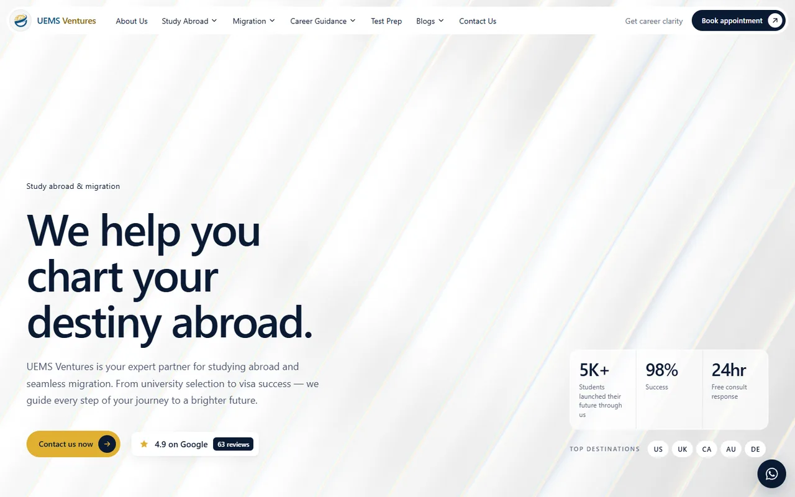
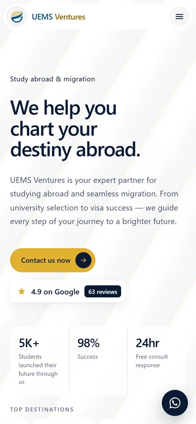
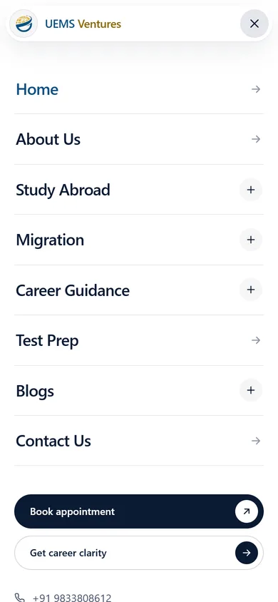
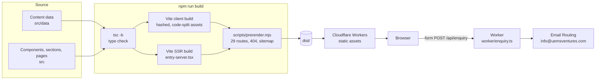
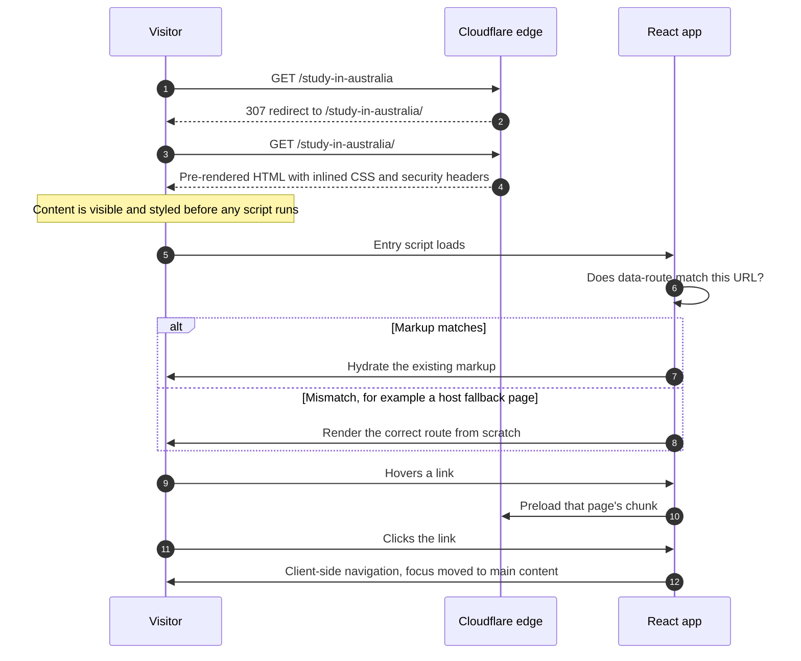
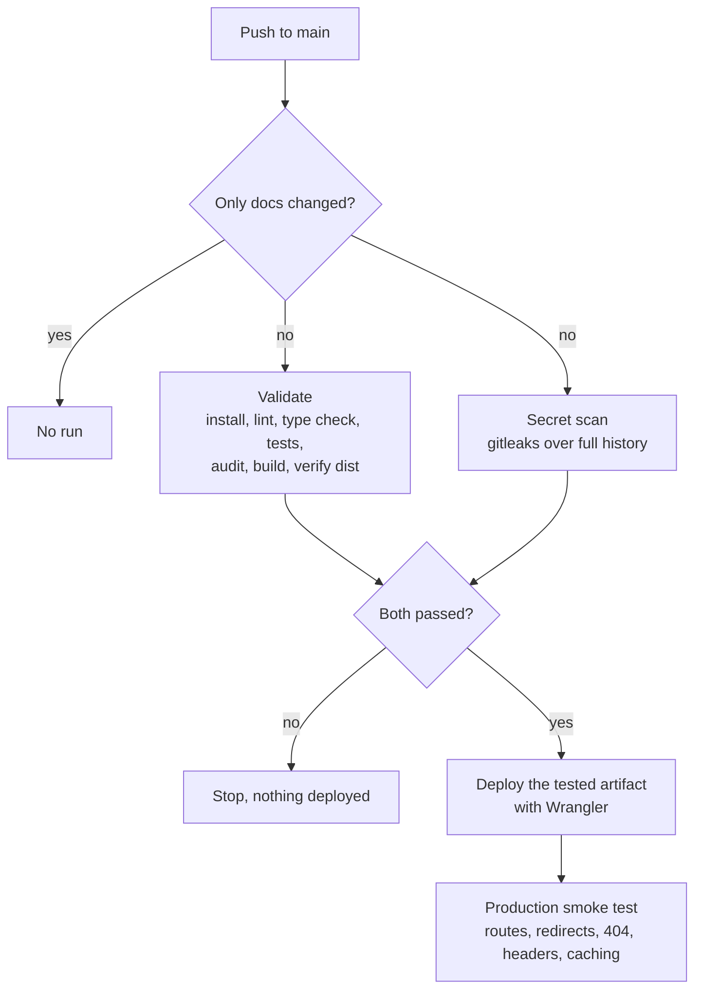

<div align="center">


<h1>UEMS Ventures</h1>

<p><strong>The website for UEMS Ventures, a Mumbai consultancy for career guidance, study abroad and migration.</strong></p>

<p>Every page is pre-rendered to static HTML and served from Cloudflare's edge, with a WebGL glass hero, full accessibility and a test-gated release pipeline.</p>

<p>
  <a href="https://github.com/spacesdrive/uems-agency/actions/workflows/ci-cd.yml"></a>
  <a href="https://uems-agency.spacesdrive.cc"></a>
  <a href="https://github.com/spacesdrive/uems-agency/commits/main"></a>
  
  
  
  
</p>

<p>
  <a href="https://uems-agency.spacesdrive.cc"><strong>Live site</strong></a>
  &nbsp;&middot;&nbsp;
  <a href="#quick-start">Quick start</a>
  &nbsp;&middot;&nbsp;
  <a href="#architecture">Architecture</a>
  &nbsp;&middot;&nbsp;
  <a href="docs/DEPLOYMENT.md">Deployment guide</a>
</p>

<br />



</div>

<br />

## Why this project

[uemsventures.com](https://uemsventures.com/) holds years of useful guidance for students and migrants, spread over 30 pages. This project keeps every page, every word and the UEMS brand, and rebuilds the experience around three goals:

- **Fast on any connection.** Visitors arrive from phones on mobile data. Every route ships as finished HTML with its CSS inlined, so the content appears before any JavaScript runs.
- **Easy to keep current.** Most pages are typed data files, not markup. Changing a destination's visa steps means editing one TypeScript object.
- **Safe to change.** Lint, type checks, 177 tests, dependency and secret scans, and a check of the build output all run before anything reaches production.

The visual language follows the [Hirael agency landing template](https://hirael.com/embed/templates/agency-landing). All content, information architecture and brand assets come from UEMS.

## Features

| Feature | What it does |
| :--- | :--- |
| **Static pre-rendering** | Each of the 29 routes is rendered at build time with `react-dom/static`, then hydrated in the browser only if the markup matches the current URL. |
| **Data-driven pages** | 21 inner pages are built from a typed block system with 16 block types (cards, steps, FAQ, tables, stats and more) and a small inline markup for bold text and links. |
| **Fluted-glass hero** | An original three-pass WebGL renderer draws a pointer-reactive ink trail behind refracting glass. It pauses off screen, draws one still frame for reduced motion, and falls back to CSS without WebGL. |
| **Accessible by default** | Skip link, managed focus on navigation, keyboard-operable tabs and menus, `inert` background under the mobile menu, and reduced-motion support throughout. |
| **Instant navigation** | Every page is its own lazy chunk. Links preload their target on hover, focus or touch, and the main routes warm up when the browser is idle. |
| **Forms that email UEMS** | Contact, free counselling and appointment forms post to a small Cloudflare Worker that emails info@uemsventures.com, with Reply-To set to the visitor. If sending is unavailable, the visitor's mail app opens with the message pre-filled. |
| **SEO essentials** | Per-page titles, descriptions, canonical URLs and Open Graph tags, organisation structured data, `sitemap.xml`, and a real 404 status for unknown URLs. |
| **Hardened delivery** | Strict Content Security Policy, HSTS and related headers, immutable caching for hashed assets, and no public preview hosts. |

<div align="center">
  
  &nbsp;&nbsp;&nbsp;
  
</div>

## Quick start

You need [Node.js](https://nodejs.org/) 22 or newer.

```bash
git clone https://github.com/spacesdrive/uems-agency.git
cd uems-agency
npm install
npm run dev
```

Open the local address Vite prints (usually `http://localhost:5173`). To produce the static site in `dist/`:

```bash
npm run build
npm run preview
```

<details>
<summary><strong>All scripts</strong></summary>

<br />

| Command | Purpose |
| :--- | :--- |
| `npm run dev` | Development server with hot reload |
| `npm run build` | Type check, client build, server build, then pre-render every route into `dist/` |
| `npm run preview` | Serve `dist/` locally |
| `npm run preview:cf` | Serve `dist/` through the Cloudflare runtime, including headers, redirects and 404 handling |
| `npm run lint` | [oxlint](https://oxc.rs/docs/guide/usage/linter) with TypeScript, React, hooks and accessibility rules |
| `npm run typecheck` | TypeScript project build for app, tests and config |
| `npm test` | Unit, component and integration tests with [Vitest](https://vitest.dev/) |
| `npm run test:coverage` | Tests with V8 coverage |
| `npm run verify:dist` | Check the build output for missing pages and leaked secrets |

</details>

## Architecture

There is no database. The build turns typed content into static files, and Cloudflare serves them. The only server code is a small Worker (`worker/`) for `/api/enquiry`, which emails form submissions to UEMS.



The pre-render step renders each route through the same `App` the browser runs. It moves the tags React 19 emits (title, meta, canonical) into `<head>`, inlines the single stylesheet, and stamps the root element with a `data-route` marker.

### What happens on a visit



### Hero renderer

`src/lib/fluidGlass.ts` is a dependency-free WebGL1 renderer written for this site:

1. **Trail pass.** A low-resolution ping-pong buffer simulates the ink and its soft shadow from pointer movement.
2. **Scene pass.** A blurred scene combines a slowly drifting swirl with the ink colour ramp.
3. **Glass pass.** Each flute refracts the scene like a glass rod, with colour dispersion at its edges, streaking along the flute axis, a rim light and fine grain.

The canvas fades in over a CSS fallback. It idles at a lower frame rate and sleeps when the hero is off screen or the tab is hidden.

## Project structure

```text
src/
  blocks/        content blocks for data-driven pages
  components/    shared UI: Header, Footer, Button, Img, EnquiryForm, HeroBackdrop and more
  data/          site details, page content, listings, generated image manifest
  layouts/       SiteLayout: header, main, footer, scroll and focus handling
  lib/           enquiry submission, fluid glass renderer, reveal observer, helpers
  pages/         route components: Home, ContentPage, Blogs, News, Contact, legal, 404
  sections/      home page sections and the contact section
  styles/        design tokens and base styles
  routes.ts      the single route table
tests/           unit, component and integration tests
scripts/         prerender, build verification, production smoke test
docs/            deployment guide and README assets
```

### Editing content

- **Company details, navigation and footer:** `src/data/site.ts`
- **Home page:** `src/data/home.ts`, reviews in `src/data/reviews.ts`, blog and news listings in `src/data/posts.ts`
- **Inner pages:** one file per page in `src/data/pages/`, typed by `src/data/types.ts`. Text supports `**bold**` and `[label](/path)`.
- **Images:** optimised WebP files at several widths in `public/images/`. `src/data/images.ts` records their sizes, so `` can output `srcset`, dimensions and lazy loading.

The test suite checks that every internal link in the content data points to a real route, so a renamed page cannot leave a broken link behind.

## Testing and quality

| Layer | Coverage |
| :--- | :--- |
| **Unit** | Link helpers, route matching, internal-link integrity across all content, JSON-LD escaping, enquiry submission through an endpoint and the email fallback |
| **Component** | Form validation and submission states, header dropdowns and mobile menu, keyboard support in the destination tabs, safe external links |
| **Integration** | Server-renders every route and checks for one `h1`, a title, a description, the canonical URL and the indexing rules |
| **Static analysis** | oxlint with accessibility rules, strict TypeScript with `noUncheckedIndexedAccess` |
| **Build output** | `scripts/verify-dist.mjs` fails on missing pages, missing headers, source maps, credential files or secret-like strings |

## Deployment

Production runs at **[uems-agency.spacesdrive.cc](https://uems-agency.spacesdrive.cc)** on [Cloudflare Workers static assets](https://developers.cloudflare.com/workers/static-assets/). Pushes to `main` that touch the app go through this pipeline:



Pull requests run the same checks without deploying. Cloudflare credentials live only in a GitHub environment restricted to `main`. The [deployment guide](docs/DEPLOYMENT.md) covers secrets, token scope, manual deploys and rollback.

`dist/` also works on any static host. Serve `404.html` for unknown paths. Without the Worker, forms open the visitor's mail app, or set `VITE_ENQUIRY_ENDPOINT` at build time to post them to another form service (see [.env.example](.env.example)).

## Content notes

- Blog cards and event listings link to the full articles on the current UEMS blog. Only the listings were migrated.
- **Seminars & Events** (`/news-and-events`) lists events from `src/data/events.ts`. To add one, put an entry at the top of `upcomingEvents` or `pastEvents`. Videos stay on the [UEMS Ventures YouTube channel](https://www.youtube.com/@uemsventures) and are linked with the optional `video` field, so the site never hosts video files.
- **Forms and Book appointment** (`/book-appointment`) post to `/api/enquiry` (`worker/enquiry.ts`), which emails info@uemsventures.com from website@spacesdrive.cc through Cloudflare Email Routing. Delivery starts once that inbox has clicked Cloudflare's one-time verification email; until then, and whenever sending fails, the visitor's mail app opens with the message addressed to UEMS. The endpoint only accepts requests from this site, limits size and rate, and can only email that one inbox.
- The former Premium Career Assessment Test page now lives inside Career Clarity Tests, and its old URL redirects there (`public/_redirects`).
- The "Write a review" link opens a Google search for the UEMS listing, because the original link used a placeholder place ID. Replace it with the real link from Google Business Profile.
- The Disclaimer page says "Coming soon", as on the current site, and is excluded from search indexing.
- Canonical URLs and the sitemap point to `https://uemsventures.com`. Change `site.url` in `src/data/site.ts` if the site moves to another domain.

## Contributing

1. Create a branch from `main`.
2. Make your change, then run `npm run lint`, `npm run typecheck` and `npm test`.
3. Open a pull request. CI runs the full validation and secret scan, and merging to `main` deploys automatically.

Stage files by name (`git add src/data/pages/ielts.ts`) rather than `git add .`. Never commit `.env` files or credentials: `.gitignore` excludes them, and CI scans every commit.

## Acknowledgements

- Content, brand and imagery: [UEMS Ventures](https://uemsventures.com/)
- Design language: [Hirael agency landing template](https://hirael.com/embed/templates/agency-landing)
- Built with [React](https://react.dev/), [React Router](https://reactrouter.com/), [Vite](https://vite.dev/), [Vitest](https://vitest.dev/), [oxlint](https://oxc.rs/) and [Wrangler](https://developers.cloudflare.com/workers/wrangler/)

## License

This repository has no open-source license. The code, content and brand assets are owned by their respective owners, and all rights are reserved.

<div align="center">
<br />
<sub>Built for UEMS Ventures, Mumbai. Questions about studying or migrating abroad? Visit <a href="https://uems-agency.spacesdrive.cc/contact-us/">the contact page</a>.</sub>
</div>
